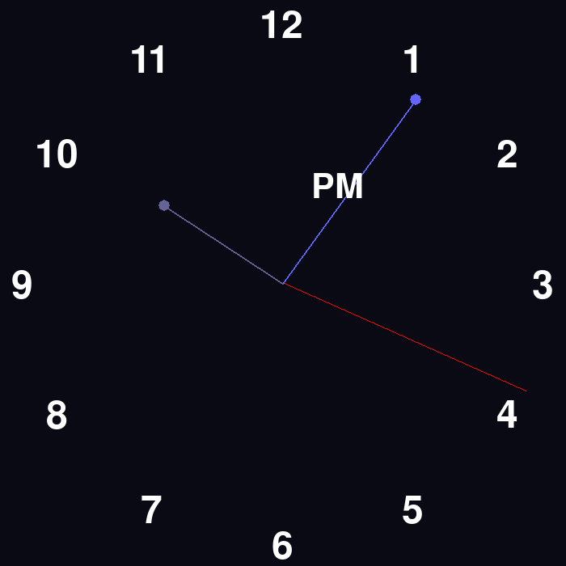

# Pytimer

pygame を使った簡単なアナログ時計です。

# Screenshot

# Usage
```bash
pyclock [-r size] 
  -r size : the size of window (s/m/l) 
```
# Install
```bash
git clone https://github.com/Index700/pyclock
cd pyclock
pip3 install -r requirements.txt
```

